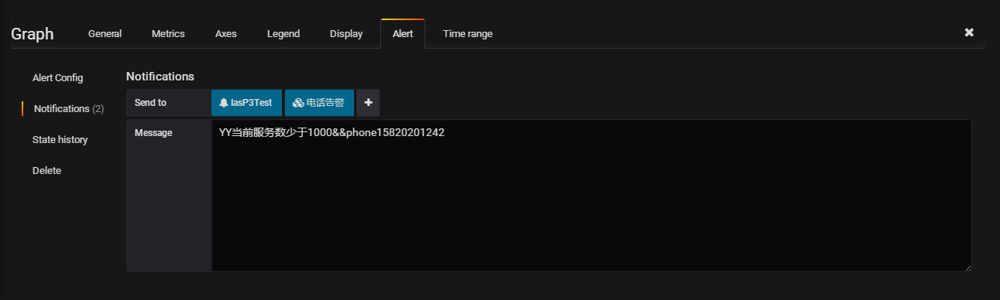

该插件基于beego web框架开发，如需编译或运行请先下载beego，安装beego请移步 https://beego.me/quickstart

关于部署，我已经将编译好的文件放到了目录下，可以直接放到Linux下的任意目录，给予执行权限运行即可。

插件现已经可以支持告警发送目标钉钉,腾讯短信,腾讯短信语音提醒以及告警信息源prometheus,graylog,grafana发出的告警信息,并且可以根据不同告警优先级发送到不同目标(暂时仅支持prometheus)

使用方法

1.prometheus只需要修改下prometheus alert插件启用webhook，可参考如下模板：
--------------------------
```
global:
  resolve_timeout: 5m

route:
  group_by: ['alertname']
  group_wait: 10m
  group_interval: 10s
  repeat_interval: 10m
  receiver: 'web.hook.dingding'
receivers:
- name: 'web.hook.dingding'
  webhook_configs:
  - url: 'http://192.168.50.73:8080/prometheus/alert'
  ```
--------------------------
webhook地址为： http://[程序部署的IP:端口]/prometheus/alert 即可.


关于告警信息：
配置Prometheus server的告警rules即可，可参考如下模板：
--------------------------------------  
```
groups:
- name: node_alert
  rules:
  - alert: 主机CPU监控
    expr: node_load1 > 3
    labels:
      severity: warning
    annotations:
      description: If this value is high, it shows that CPU is very complex and very high !  #告警信息
      summary: "{{ $labels.instance }} node CPU load is ok !(current value: {{ $value }}s)"  #告警恢复信息
      level: 3   #告警级别,告警级别定义 0 信息,1 警告,2 一般严重,3 严重,4 灾难
      mobile: 15110176396,15395105573,18513149060  #告警发送目标电话,需要设置电话和短信告警级别
      #支持添加多个钉钉告警,用,号分割即可,如果留空或者未填写,则默认发送到配置文件中填写的钉钉地址
      ddurl: "https://oapi.dingtalk.com/robot/send?access_token=f259e295a8f63c93b44498c53aba170882f948b2e967ac6027a82ecd82b9db43,https://oapi.dingtalk.com/robot/send?access_token=914129ff5cd8199072773d736c6bbfabe421f19a9af9511374d687ee04843f24"
```
--------------------------------------      

显示到钉钉的告警信息如下：
--------------------------------------


内容还不算很完善，有什么好的建议可以直接与我联系，我抽空多丰富些功能

现在已经支持graylog的alert
router 是 graylog/alert

--------------------------------------
已经支持grafana webhook告警,同时支持grafana告警发送到多个钉钉和腾讯电话语音告警
可在grafana的alert中配置Alert-->Notifications-->Message
格式: 告警信息&&phone告警手机号,告警手机号&&ddurl钉钉机器人地址,钉钉机器人地址
默认不填写手机号不触发电话告警,钉钉告警为默认告警(支持向多个钉钉告警)


--------------------------------------
QQ:244217140
