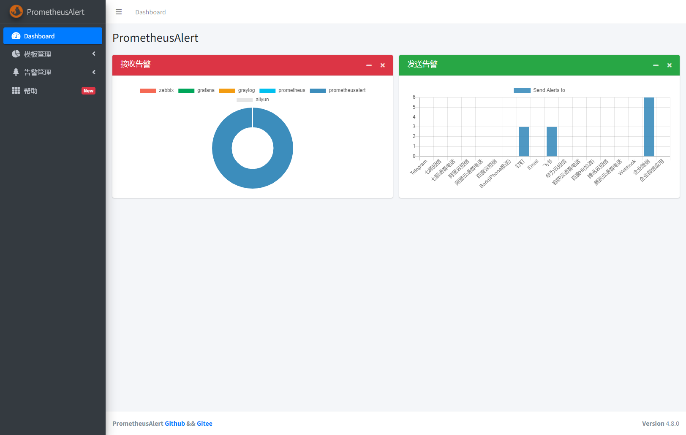
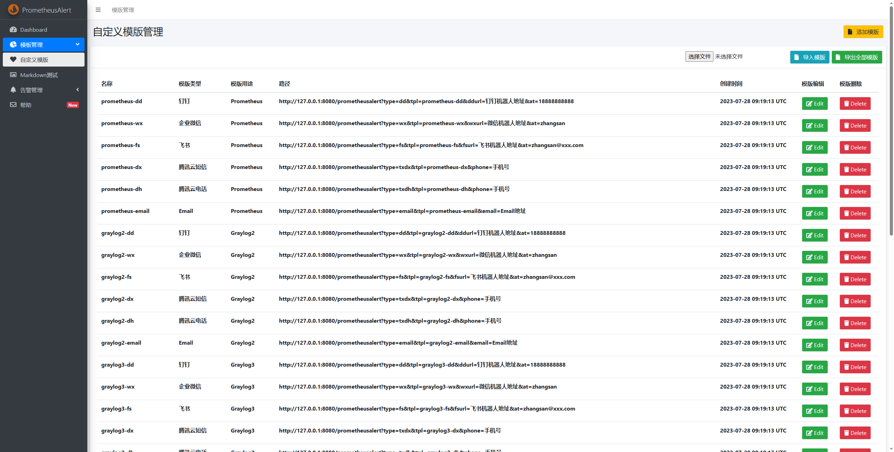

# PrometheusAlert全家桶

---------------------------------------


[](https://hub.docker.com/r/feiyu563/prometheus-alert)

[](https://github.com/feiyu563/PrometheusAlert/releases)

[]()
[]()
[]()

---------------------------------------

PrometheusAlert是开源的运维告警中心消息转发系统，支持主流的监控系统Prometheus、Zabbix，日志系统Graylog2，Graylog3、数据可视化系统Grafana、SonarQube。阿里云-云监控，以及所有支持WebHook接口的系统发出的预警消息，支持将收到的这些消息发送到钉钉，微信，email，飞书，腾讯短信，腾讯电话，阿里云短信，阿里云电话，华为短信，百度云短信，容联云电话，七陌短信，七陌语音，TeleGram，百度Hi(如流)等。


----------------------------------------

* 如果这个项目能为您带来帮助，我将感到非常荣幸！同时非常欢迎您加入PrometheusAlert全家桶的微信群一起探讨关于PrometheusAlert新一期的开发计划。

* PrometheusAlert的成长离不开所有爱好运维和开发的朋友们的支持！如果您也对这个项目感兴趣，请点击一下 Star 以示鼓励，谢谢

----------------------------------------

## 构建

应用信息和构建相关的命令都写入了Makefile，请确保安装`make`, `git`, `go`命令。如有特定需要，请自行修改Makefile。

```bash
# 默认
make

# 只运行构建
make build

# 运行 go fmt
make format

# 运行 go vet
make vet

# 运行 go test
make test

# 构建镜像
make docker

# 推送镜像
make docker-push

# 运行镜像测试
make docker-test


# 运行
copy conf/app-example.conf conf/app.conf
./PrometheusAlert
# 测试应用健康
curl http://localhost:8080/health
```

-------------------------------------

## 启动

```
#打开PrometheusAlert releases页面，根据需要选择需要的版本下载到本地解压并进入解压后的目录
如linux版本(https://github.com/feiyu563/PrometheusAlert/releases/download/v4.7/linux.zip)

# wget https://github.com/feiyu563/PrometheusAlert/releases/download/v4.7/linux.zip && unzip linux.zip &&cd linux/

#运行PrometheusAlert
# ./PrometheusAlert (#后台运行请执行 nohup ./PrometheusAlert &)

#启动后可使用浏览器打开以下地址查看：http://127.0.0.1:8080
#默认登录帐号和密码在app.conf中有配置
```

## Docker 启动

配置文件 app.conf 的内容可以使用环境变量的方式初始化。

所设置的变量前缀必须以 `PA_` 开始，后面使用配置文件的配置项名称，**但是需要将配置项中所有的 `-` 替换为 `_`**。

特别注意的是使用环境变量对配置项中的大小写并不敏感。

示例

```
docker run -d \
-p 8080:8080 \
-e PA_LOGIN_USER=prometheusalert \
-e PA_LOGIN_PASSWORD=prometheusalert \
-e PA_TITLE=PrometheusAlert \
-e PA_OPEN_FEISHU=1 \
-e PA_OPEN_DINGDING=1 \
-e PA_OPEN_WEIXIN=1 \
feiyu563/prometheus-alert:latest
```

所有的配置文件内容请[点击此处](https://github.com/feiyu563/PrometheusAlert/blob/master/conf/app-example.conf)查看

---------------------------------------




--------------------------------------

## PrometheusAlert具备如下特性

--------------------------------------

 - 支持任意包含WebHook接口系统的消息作为消息来源，常见的如Prometheus，Zabbix，Graylog2，Graylog3，Grafana，SonarQube和其他WebHook接口的系统。
 - 支持多种类型的发送目标，支持钉钉，企业微信，email，飞书，腾讯短信，腾讯语音，阿里云短信，阿里云语音，华为短信，百度云短信，容联云电话，七陌短信，七陌语音，TeleGram，百度Hi(如流)。
 - 针对Prometheus增加了告警级别，并且支持按照不同级别发送消息到不同目标对象。
 - 简化Prometheus分组配置，支持按照具体消息发送到单个或多个接收方。
 - 增加手机号码配置项和号码自动轮询配置，可固定发送给单一个人告警信息，也可以通过自动轮询的方式发送到多个人员且支持按照不同日期发送到不同人员。
 - 增加Dashboard，提供配置测试，告警消息模版自定义，告警模版测试等功能
 - 增加自定义告警消息模版支持，可以通过自定义模版对任意服务WebHook进行支持
 - 增加代理支持
 - 增加支持mysql、sqlite3(默认)、postgres作为模版存储，便于集群化部署
 - 增加支持钉钉，企业微信的@某人功能
 - 增加支持阿里云-云监控告警
 - 增加随机轮询，目前仅针对ddurl，fsurl，wxurl有效，默认情况下如果上述Url配置的是多个地址，则多个地址全部发送，如开启该选项，则从多个地址中随机取一个地址发送，主要是为了避免消息发送频率过高导致触发部分机器人拦截消息
 - 增加支持将Prometheus告警记录写入到Elasticsearch7.x，可通过Kibana进行界面查看告警记录和配置表格导出。
 - 增加支持将Gitlab webhook event推送到企微和钉钉。
 - 增加告警路由和告警记录功能，可通过页面查看告警历史和操作告警消息路由。
 - 增加告警语音播报插件。
 - 增加支持飞书机器人应用。

-------------------------------------

## 致谢以下伙伴对PrometheusAlert的贡献

--------------------------------------

 - [@cyancow](https://github.com/cyancow)
 - [@birkh8792](https://github.com/birkh8792)
 - [@minibear2333](https://github.com/minibear2333)
 - [@bigdimple](https://github.com/bigdimple)
 - [@ysicing](https://github.com/ysicing)
 - [@Zhang21](https://github.com/Zhang21)
 - [@jicki](https://github.com/jicki)
 - [@guvmao](https://github.com/guvmao)
 - [@lusson-luo](https://github.com/lusson-luo)

--------------------------------------

## PrometheusAlert全家桶新手入门

--------------------------------------

### 系统接入PrometheusAlert流程

#### PrometheusAlert的原理就是通过自定义模版接口`/prometheusalert`接收各种告警系统或者任何带有WebHook功能的系统发来的消息，然后将收到的消息经过自定义模板渲染成消息文本，最终转发给不同的接收目标。

#### 一般情况下如果使用的是钉钉，企业微信、飞书等机器人作为接收目标的，可以不去配置PrometheusAlert的配置文件app.conf；但是如果需要使用如短信，电话，邮箱等功能，则需要先配置好app.conf中的相关配置项方可使用。

- 1.安装好PrometheusAlert 参考：[安装部署PrometheusAlert](doc/readme/base-install.md)
- 2.配置 app.conf [可选] 参考：[【 app.conf 默认参数配置】](doc/readme/conf.md)
- 3.配置告警系统接入PrometheusAlert 参考：[【告警系统接入PrometheusAlert配置】](doc/readme/system.md)

-------------------------------------

### 目录

* [【PrometheusAlert入门】](doc/readme/base-install.md)
  * [安装部署PrometheusAlert](doc/readme/base-install.md)
  * [接口说明](doc/readme/base-restful.md)
  * [Metrics指标](doc/readme/base-metrics.md)
  * [其他配置](doc/readme/base-other.md)

* [【 app.conf 默认参数配置】](doc/readme/conf.md)
  * [钉钉告警配置](doc/readme/conf-dingding.md)
  * [飞书告警配置](doc/readme/conf-feishu.md)
  * [企业微信告警配置](doc/readme/conf-wechat.md)
  * [企业微信应用告警配置](doc/readme/conf-workwechat.md)
  * [阿里云短信和电话告警配置](doc/readme/conf-aliyun.md)
  * [腾讯云短信和电话告警配置](doc/readme/conf-tx.md)
  * [容联云电话告警配置](doc/readme/conf-rly.md)
  * [华为云短信配置](doc/readme/conf-hw.md)
  * [百度云短信配置](doc/readme/conf-bd.md)
  * [Email配置](doc/readme/conf-email.md)
  * [七陌短信和电话告警配置](doc/readme/conf-7moor.md)
  * [TeleGram告警配置](doc/readme/conf-tg.md)
  * [Bark告警配置](doc/readme/conf-bark.md)
  * [百度Hi(如流)告警配置](doc/readme/conf-ruliu.md)
  * [告警记录-ES接入配置](doc/readme/conf-es.md)
  * [语音播报](doc/readme/conf-voice.md)
  * [飞书机器人应用](doc/readme/conf-feishuapp.md)

* [【告警系统接入PrometheusAlert配置】](doc/readme/system.md)
  * [Prometheus 接入配置](doc/readme/system-prometheus.md)
  * [graylog接入配置](doc/readme/system-graylog.md)
  * [grafana接入配置](doc/readme/system-grafana.md)
  * [zabbix（内置固定消息模版）接入配置](doc/readme/system-zabbix.md)
  * [sonarqube接入配置](doc/readme/system-sonarqube.md)
  * [jenkins接入配置](doc/readme/system-jenkins.md)
  * [阿里云-云监控（自定义消息模版）接入配置](doc/readme/system-yunjiankong.md)
  * [Gitlab webhook接入配置](doc/readme/system-gitlab.md)
  * [【WebHook】](doc/readme/system-webhook.md)
  * [★ 进阶用法--自定义模版](doc/readme/system-customtpl.md)
  * [★ 进阶用法--自定义模版函数(时区转换、文本操作等)](doc/readme/system-func.md)
  * [★ 进阶用法--自定义模版参数说明](doc/readme/system-var.md)
  * [★ 进阶用法--go模版语法](doc/readme/system-go-template.md)

* [【Dashboard页面功能使用】](doc/readme/web.md)
  * [【告警路由功能】](doc/readme/web-router.md)

* [【版本更新说明】](https://github.com/feiyu563/PrometheusAlert/releases)
* [【如何对PrometheusAlert进行二次开发】](https://github.com/feiyu563/PrometheusAlert/wiki/%E5%A6%82%E4%BD%95%E8%BF%9B%E8%A1%8C%E3%80%90PrometheusAlert%E3%80%91%E4%BA%8C%E6%AC%A1%E5%BC%80%E5%8F%91)
* [通用自定义模板共享链接](https://github.com/feiyu563/PrometheusAlert/issues/30)
* [Prometheus rules共享链接](https://github.com/feiyu563/PrometheusAlert/issues/89)
* [【如何捐赠】](doc/readme/donate.md)

--------------------------------------

项目源码

--------------------------------------

 - [【GitHub】: PrometheusAlert](https://github.com/feiyu563/PrometheusAlert)
 - [【码云】: PrometheusAlert](https://gitee.com/feiyu563/PrometheusAlert)

--------------------------------------

加入PrometheusAlert微信交流群

--------------------------------------


---

Email: 244217140@qq.com

----
