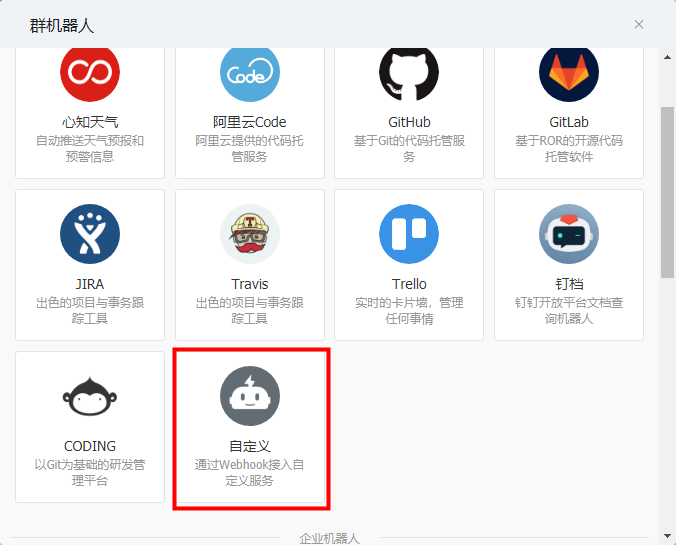
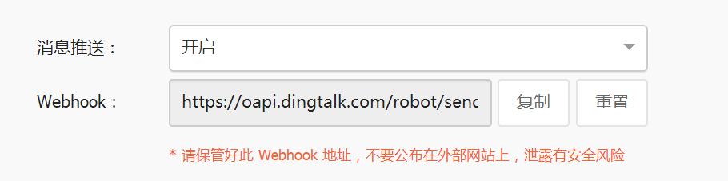

# PrometheusAlert全家桶钉钉配置说明

## 开启钉钉机器人

打开钉钉,进入钉钉群中,选择群设置-->智能群助手-->添加机器人-->自定义，可参下图：




<br/>

新版本的钉钉加了安全设置,只需选择安全设置中的 自定义关键词 即可,并将关键词设置为 Prometheus或者app.conf中设置的title值均可,参考下图




复制图中的Webhook地址，并填入PrometheusAlert配置文件app.conf中对应配置项即可。

<br/>

 **PS: 钉钉机器人目前已经支持 `@某人` ,使用该功能需要取得对应用户的钉钉关联手机号码，如下图：**


钉钉目前支持只支持markdown语法的子集，具体支持的元素如下：

```md
标题
# 一级标题
## 二级标题
### 三级标题
#### 四级标题
##### 五级标题
###### 六级标题

引用
> A man who stands for nothing will fall for anything.

文字加粗、斜体
**bold**
*italic*

链接
[this is a link](http://name.com)

图片


无序列表
- item1
- item2

有序列表
1. item1
2. item2
```

<br/>
<br/>

## 钉钉加签配置

**建议使用 [告警组](alertgroup.md) 来配置钉钉地址和加签配置**。

<br/>

增加钉钉加签的配置。创建自定义机器人的时候，选择加签，并复制加签内容组装到到机器人地址参数（webhook url parm secret）。程序会获取这个 `secret` 参数，进行加签处理之后生成对应的加签地址。

如果配置文件中启用了钉钉加签认证，但 webhook url 并没有传递 parm secret，那么程序将返回不加签的地址。也就是说，PrometheusAlert 配置中启用钉钉加签并不会影响不加签的机器人。

[issue:363](https://github.com/feiyu563/PrometheusAlert/issues/363) 关于自定义模板使用 URL 传递 ddurl 和签名报错，需要修改使用方法。

在自定义模板 URL 参数的 ddurl 里面可能有多个地址，有的加签，有的不加签。因此代码不太好处理，暂时没有解决。建议使用告警组或将 `&` 符号替换为 `%26` 编码。

默认模板、配置文件和使用告警组的钉钉加签是正常的。

<br/>

配置文件传递地址示例如下：

```conf
# 默认的钉钉机器人地址 webhook url 格式
https://oapi.dingtalk.com/robot/send?access_token=XXX

# 假如机器人加签内容为：mysecret
# 带上加签参数: secret=mysecret
https://oapi.dingtalk.com/robot/send?access_token=XXX&secret=mysecret

# 程序加签处理后生成的加签地址: https://oapi.dingtalk.com/robot/send?access_token=XXXXXX&timestamp=XXX&sign=XXX

# 如果配置文件中启用了钉钉加签认证，但 webhook url 并没有传递 parm secret，那么程序将返回不加签的地址
https://oapi.dingtalk.com/robot/send?access_token=XXX
```

<br/>

自定义模板 URL 参数传递地址配置如下:

```conf
# 使用告警组配置地址
http://prometheusalert:8080/prometheusalert?type=dd&tpl=prometheus-dd&alertgroup=xxx&at=xxx

# 需要把 & 特殊字符转义为 %26 编码字符
# 单个地址
http://prometheusalert:8080/prometheusalert?type=dd&tpl=prometheus-dd&ddurl=加签地址%26secret=xxx&at=xxx

# 多个地址
http://prometheusalert:8080/prometheusalert?type=dd&tpl=prometheus-dd&ddurl=加签地址%26secret=xxx,加签地址%26secret=xxx

# 混合加签和不加签地址
http://prometheusalert:8080/prometheusalert?type=dd&tpl=prometheus-dd&ddurl=不加签地址,加签地址%26secret=xxx
```

<br/>
<br/>

## 钉钉相关配置

```ini
#---------------------↓全局配置-----------------------
#告警消息标题
title=PrometheusAlert
#钉钉告警 告警logo图标地址
logourl=https://raw.githubusercontent.com/feiyu563/PrometheusAlert/master/doc/alert-center.png
#钉钉告警 恢复logo图标地址
rlogourl=https://raw.githubusercontent.com/feiyu563/PrometheusAlert/master/doc/alert-center.png

#---------------------↓webhook-----------------------
#是否开启钉钉告警通道,可同时开始多个通道0为关闭,1为开启
open-dingding=1
#默认钉钉机器人地址
ddurl=https://oapi.dingtalk.com/robot/send?access_token=xxxxx
#是否开启 @所有人(0为关闭,1为开启)
dd_isatall=1
#是否开启钉钉机器人加签，0为关闭,1为开启
# 使用方法：https://oapi.dingtalk.com/robot/send?access_token=XXXXXX&secret=mysecret
open-dingding-secret=0
```

<br/>
<br/>

## 如何使用

以Prometheus配合自定义模板为例：

Prometheus配置参考：

```yml
global:
  resolve_timeout: 5m
route:
  group_by: ['instance']
  group_wait: 10m
  group_interval: 10s
  repeat_interval: 10m
  receiver: 'web.hook.prometheusalert'
receivers:
- name: 'web.hook.prometheusalert'
  webhook_configs:
  - url: 'http://[prometheusalert_url]:8080/prometheusalert?type=dd&tpl=prometheus-dd&ddurl=钉钉机器人地址,钉钉机器人地址2&at=18888888888,18888888889'
```
