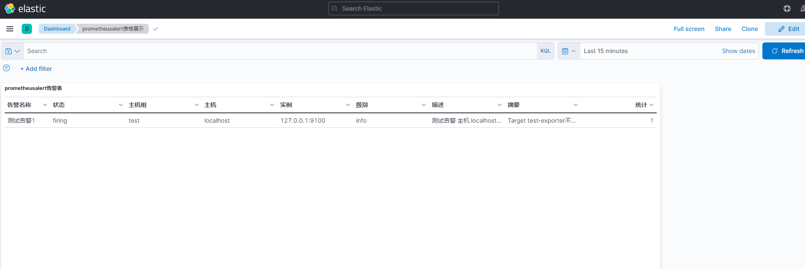

# 告警记录写入Elasticsearch

**注意**:
- 客户端适配的是ES7.x版本!
- 索引根据年月动态创建`prometheusalert-YYMM`(如prometheusalert-202112)

## es相关配置

```conf
# 是否将告警记录写入es7，0为关闭，1为开启
alert_to_es=0

# es地址，是[]string
# beego.AppConfig.Strings读取配置为[]string，使用";"而不是","
# 单个地址
to_es_url=http://localhost:9200
# 多个地址
# to_es_url=http://es1:9200;http://es2:9200;http://es3:9200

# 是否有认证，es用户和密码, 无认证则不需要填写。
# to_es_user=username
# to_es_pwd=password
```

## Kibana展示效果

可直接创建索引模式展示告警记录。还可以自行创建表格、柱状图等展示。



