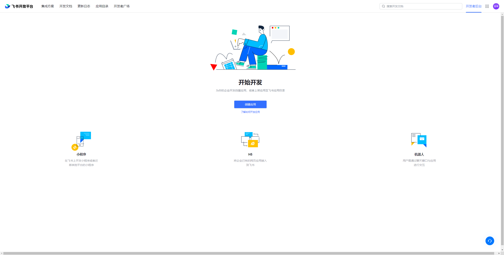
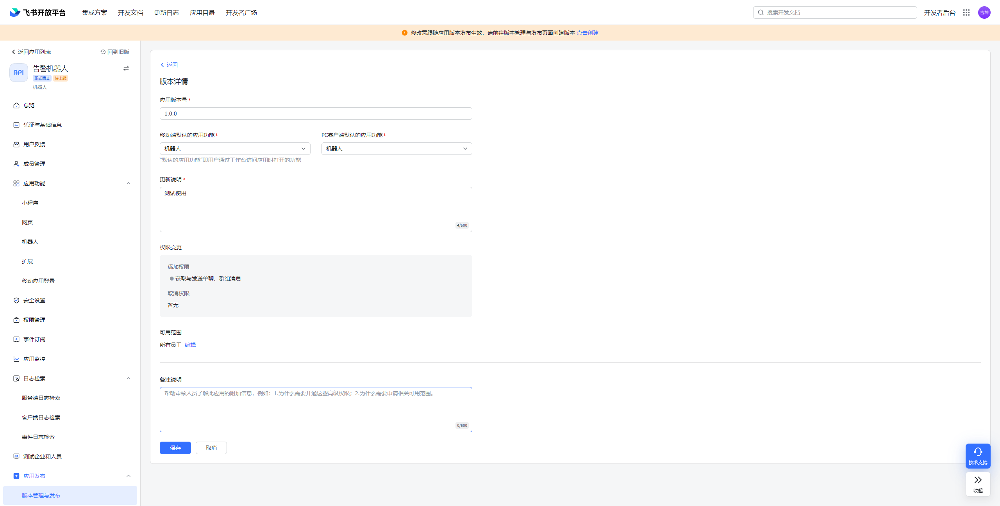
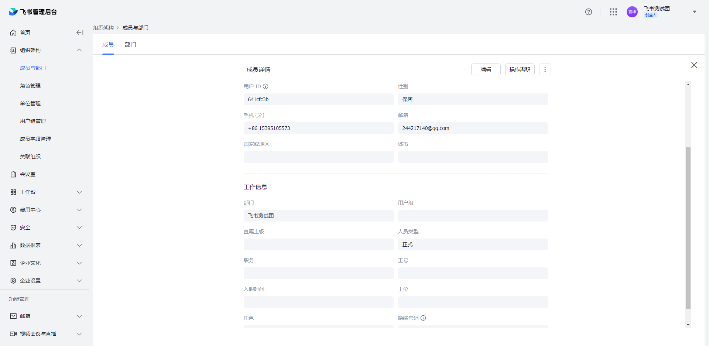

# PrometheusAlert全家桶飞书机器人应用配置说明

-----------------

**特别注意：飞书应用使用的是批量发送消息接口，消息会有一定延迟，且必须要有至少一个飞书用户open_id或user_id或union_ids或部门open_department_id，否则无法收取消息**

**创建飞书应用**

打开飞书开放平台，创建飞书企业自建app应用 https://open.feishu.cn/app/




创建完成后，选择刚刚创建的应用，进入应用管理后台，选择 应用功能--> 机器人，开启应用的机器人能力


继续分配应用权限，选择 权限管理--> 消息与群组，开通以下权限
 - 给多个用户批量发消息
 - 给一个或多个部门的成员批量发消息
 - 获取与发送单聊、群组消息


最后发布应用版本，让具有管理员权限的用户去审核申请的权限和发布请求即可



审核完成后，获取到飞书应用的 `App ID`和`App Secret`，并配置到PrometheusAlert 的 app.conf配置项目中


**飞书应用app.conf配置**

```
#---------------------↓飞书机器人应用-----------------------
#是否开启feishuapp告警通道,可同时开始多个通道0为关闭,1为开启
open-feishuapp=1
# APPID
FEISHU_APPID=cli_xxxxxxxxxxxxxxxxxxxxx
# APPSECRET
FEISHU_APPSECRET=xxxxxxxxxxxxxxxxxxxxxxxxxxxxxxxxx
# 可填飞书 用户open_id、user_id、union_ids、部门open_department_id
AT_USER_ID="xxxxxxxxxxx"
```

**如何查找user_id**

通过飞书管理员登录飞书管理后台，进入 组织架构-->成员与部门-->找到对应的用户，查看成员详情即可



**如何使用**

以Prometheus配合自定义模板为例：

Prometheus配置参考：

```
global:
  resolve_timeout: 5m
route:
  group_by: ['instance']
  group_wait: 10m
  group_interval: 10s
  repeat_interval: 10m
  receiver: 'web.hook.prometheusalert'
receivers:
- name: 'web.hook.prometheusalert'
  webhook_configs:
  - url: 'http://[prometheusalert_url]:8080/prometheusalert?type=fsapp&tpl=prometheus-feishu-app&at=xxxxxxxx,xxxxxx2,xxxxxxx3'
```