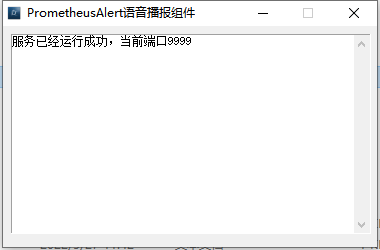

# PrometheusAlert全家桶语音播报配置说明

-----------------

语音播报功能需要配合`PrometheusAlert语音播报组件`一起使用，组件可以在github的release版本中下载或直接使用项目源码`PrometheusAlertVoice`文件夹中的可执行文件

语音播报插件实际就是一款可以支持PrometheusAlert文本消息转换语音的客户端工具。语音播报原理如下：

WebHook--> PrometheusAlert --> PrometheusAlert语音播报组件

语音播报插件目前仅支持windows系统。



```
#---------------------↓语音播报-----------------------
#语音播报需要配合语音播报插件才能使用
#是否开启语音播报通道,0为关闭,1为开启
open-voice=1
VOICE_IP=127.0.0.1
VOICE_PORT=9999
```

**如何使用**

以Prometheus配合自定义模板为例：

Prometheus配置参考：

```
global:
  resolve_timeout: 5m
route:
  group_by: ['instance']
  group_wait: 10m
  group_interval: 10s
  repeat_interval: 10m
  receiver: 'web.hook.prometheusalert'
receivers:
- name: 'web.hook.prometheusalert'
  webhook_configs:
  - url: 'http://[prometheusalert_url]:8080/prometheusalert?type=voice&tpl=prometheus-voice'
```