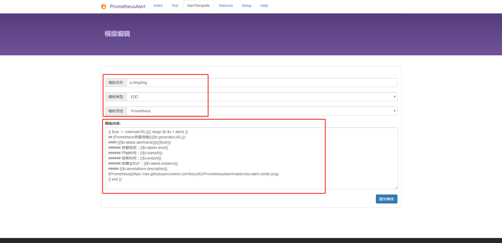
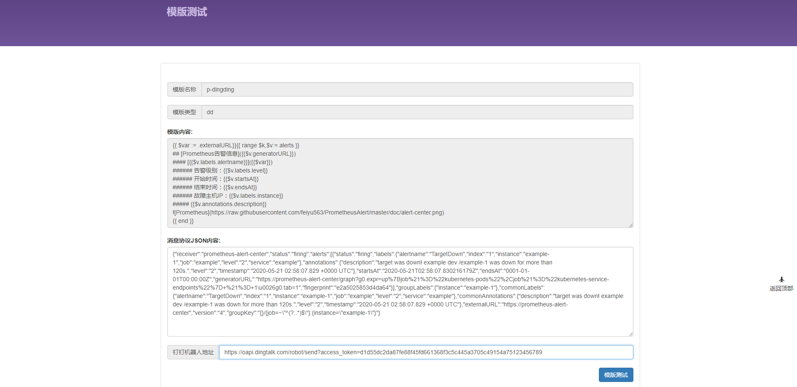
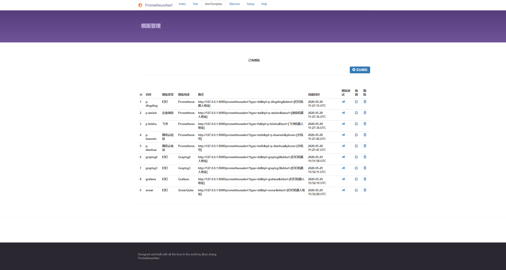

# 自定义告警消息模版使用说明

--------------------------------------

### 自定义告警消息模版可以支持任意带有WebHook服务的系统接入到PrometheusAlert上。

### PrometheusAlert 原理：

#### PrometheusAlert 的自定义模板接口 `/prometheusalert` 专门用来接收外部服务传入的 HTTP POST 的 JSON 数据（通常带有WebHook的软件都可以接入PrometheusAlert），`/prometheusalert` 接口在接收到JSON数据后，会根据Url中的`tpl`参数去查找对应的自定义模板，通过找到的模板去渲染JSON以便输出渲染后的文本，最后将渲染后的文本转发给指定的目标，如钉钉机器人，从而实现钉钉告警。

#### 流程参考：

```mermaid
graph TD;
    XXX-WebHook-->POST-JSON;
    POST-JSON-->/prometheusalert?type=dd&tpl=prometheus-dingding&ddurl=https://oapi.dingtalk.com/robot/send?access_token=xxxx;
    /prometheusalert?type=dd&tpl=prometheus-dingding&ddurl=https://oapi.dingtalk.com/robot/send?access_token=xxxx-->PrometheusAlert通过tpl模版prometheus-dingding渲染收到的JSON;
    PrometheusAlert通过tpl模版prometheus-dingding渲染收到的JSON-->https://oapi.dingtalk.com/robot/send?access_token=xxxx;
    https://oapi.dingtalk.com/robot/send?access_token=xxxx-->钉钉机器人完成告警;
```

----------------------------------------------------------------------

### 下面以Prometheus为例演示下完整的使用自定义模板流程

----------------------------------------------------------------------
## 一、配置WebHook将消息转发给PrometheusAlert
----------------------------------------------------------------------

### 1.更改Alertmanager的配置，将所有告警信息都转发到PrometheusAlert自定义接口,参考如下：

  * 这么配置主要是为了方便调试和获取到Prometheus告警消息接口的JSON协议内容，其他的如grafana、graylog、sonarqube等支持WebHook的系统可以直接在控制台页面配置上`http://[YOUR-PrometheusAlert-URL]/prometheusalert`自定义消息模版的接口即可

```
global:
  resolve_timeout: 5m
route:
  group_by: ['instance']
  group_wait: 10m
  group_interval: 10s
  repeat_interval: 10m
  receiver: 'PrometheusAlert'
receivers:
- name: 'PrometheusAlert'
  webhook_configs:
  - url: 'http://[YOUR-PrometheusAlert-URL]/prometheusalert?type=dd&tpl=prometheus-dingding'
```

配置完成后，重启或者reload Alertmanager，使配置生效。

- 可手动或等待Prometheus告警触发后，去PrometheusAlert中查看收到的日志消息。找到类似下面的内容（日志文件在log目录下）,json格式的消息一般都是`{`开头：

```
2020/05/21 10:58:17.850 [D] [value.go:460]  [1590029897850034963] {"receiver":"prometheus-alert-center","status":"firing","alerts":[{"status":"firing","labels":{"alertname":"TargetDown","index":"1","instance":"example-1","job":"example","level":"2","service":"example"},"annotations":{"description":"target was down! example dev /example-1 was down for more than 120s.","level":"2","timestamp":"2020-05-21 02:58:07.829 +0000 UTC"},"startsAt":"2020-05-21T02:58:07.830216179Z","endsAt":"0001-01-01T00:00:00Z","generatorURL":"https://prometheus-alert-center/graph?g0.expr=up%7Bjob%21%3D%22kubernetes-pods%22%2Cjob%21%3D%22kubernetes-service-endpoints%22%7D+%21%3D+1\u0026g0.tab=1","fingerprint":"e2a5025853d4da64"}],"groupLabels":{"instance":"example-1"},"commonLabels":{"alertname":"TargetDown","index":"1","instance":"example-1","job":"example","level":"2","service":"example"},"commonAnnotations":{"description":"target was down! example dev /example-1 was down for more than 120s.","level":"2","timestamp":"2020-05-21 02:58:07.829 +0000 UTC"},"externalURL":"https://prometheus-alert-center","version":"4","groupKey":"{}/{job=~\"^(?:.*)$\"}:{instance=\"example-1\"}"}
```

- 截取日志中的JSON内容（主要是`{.....}`这部分），通过任意[json格式化工具](https://www.bejson.com/)进行格式化如下：

```
{
	"receiver": "prometheus-alert-center",
	"status": "firing",
	"alerts": [{
		"status": "firing",
		"labels": {
			"alertname": "TargetDown",
			"index": "1",
			"instance": "example-1",
			"job": "example",
			"level": "2",
			"service": "example"
		},
		"annotations": {
			"description": "target was down! example dev /example-1 was down for more than 120s.",
			"level": "2",
			"timestamp": "2020-05-21 02:58:07.829 +0000 UTC"
		},
		"startsAt": "2020-05-21T02:58:07.830216179Z",
		"endsAt": "0001-01-01T00:00:00Z",
		"generatorURL": "https://prometheus-alert-center/graph?g0.expr=up%7Bjob%21%3D%22kubernetes-pods%22%2Cjob%21%3D%22kubernetes-service-endpoints%22%7D+%21%3D+1\u0026g0.tab=1",
		"fingerprint": "e2a5025853d4da64"
	}],
	"groupLabels": {
		"instance": "example-1"
	},
	"commonLabels": {
		"alertname": "TargetDown",
		"index": "1",
		"instance": "example-1",
		"job": "example",
		"level": "2",
		"service": "example"
	},
	"commonAnnotations": {
		"description": "target was down! example dev /example-1 was down for more than 120s.",
		"level": "2",
		"timestamp": "2020-05-21 02:58:07.829 +0000 UTC"
	},
	"externalURL": "https://prometheus-alert-center",
	"version": "4",
	"groupKey": "{}/{job=~\"^(?:.*)$\"}:{instance=\"example-1\"}"
}
```

----------------------------------------------------------------------
## 二、对照JSON新建自定义模板(为方便调试，编写模版可以在web页面的MarkDownTest进行)
----------------------------------------------------------------------

* 然后对照该JSON开始编写模版,并在Dashboard上进行添加,示例模版如下：

```
{{ $var := .externalURL}}{{ range $k,$v:=.alerts }}
## [Prometheus告警信息]({{$v.generatorURL}})
#### [{{$v.labels.alertname}}]({{$var}})
###### 告警级别：{{$v.labels.level}}
###### 开始时间：{{$v.startsAt}}
###### 结束时间：{{$v.endsAt}}
###### 故障主机IP：{{$v.labels.instance}}
##### {{$v.annotations.description}}

{{ end }}
```

* 添加到Dashboard中，并选择对应模版类型和模版用途，注意模版名称一定不要重复,且一定要是英文字符。




* 添加完自定义模板后，一定要点击保存。

----------------------------------------------------------------------
## 三、测试自定义模板
----------------------------------------------------------------------

### 1.对新添加的模版进行测试

- 打开PrometheusAlert Dashboard的模版管理页面`AlertTemplate`

  * 在表格中找到刚刚创建的自定义模版，点击右侧的模版测试按钮，进入模版测试页面



- 将之前从PrometheusAlert日志中提取的JSON填入`消息协议JSON内容`文本框中，且输入钉钉机器人地址(如模版的类型不是钉钉，模版测试页面的地址输入框显示会不同名称，如微信机器人地址等)

- 继续点击模版测试按钮即可对新添加的模版进行测试，如模版没有错误，将会收到对应的钉钉消息，如无法收到钉钉消息，请检查模版是否有什么地方配置错误

----------------------------------------------------------------------
## 四、使用自定义模板
----------------------------------------------------------------------

### 1.自定义告警消息模版接口使用非常简单

- 打开PrometheusAlert Dashboard的模版管理页面`AlertTemplate`

  * 找到需要使用的自定义消息模版，复制表格中`路径`一列的地址内容，并将地址中`[xxxxx]`中的地址或手机号替换成你实际的配置，将其粘贴到对应的WebHook地址配置中即可。(注意事项：自定义模版中的手机号是可以忽略的，如果不在url中配置手机号参数，则会优先读取user.csv中的手机号，如未读取到，则会取app.conf中的默认手机号)

  * 如prometheus alertmanager配置如下：
```
- name: 'prometheusalert-all'
  webhook_configs:
  - url: 'http://[prometheusalert_url]:8080/prometheusalert?type=dd&tpl=prometheus-dd&ddurl=钉钉机器人地址'
  #注意：url参数中 ddurl、wxurl、fsurl、phone、email、wxuser、wxparty、wxtag、groupid等可不写，如不写这些参数，则会默认去读取配置文件中的对应参数发送消息
```




至此完成！其他的一些支持WebHook的系统也可以通过同样的方式和流程来添加。

----------------------------------------------------------------------
## 自定义模版的一些说明
----------------------------------------------------------------------

#### 1.钉钉机器人、企业微信机器人均已经支持@某人的功能。使用时，需要在Url中加入`&at= 1539510xxxx`；如需添加多个@目标，用,号分割即可。此处需注意：钉钉@使用的是手机号码，企业微信机器人@使用的是用户帐号。

`示例：http://[prometheusalert_url]:8080/prometheusalert?type=dd&tpl=prometheus-dd&ddurl=https://oapi.dingtalk.com/robot/send?access_token=xxxx&at= 1539510xxxx`


#### 2.url参数中 `ddurl、wxurl、fsurl、phone、email、wxuser、wxparty、wxtag、groupid `等可不写，如不写这些参数，则会默认去读取配置文件中的对应参数发送消息。

`示例：http://[prometheusalert_url]:8080/prometheusalert?type=dd&tpl=prometheus-dd`


#### 3.url参数中支持参数 `rr=true`， 该参数为开启随机轮询，目前仅针对ddurl，fsurl，wxurl有效，默认情况下如果上述Url配置的是多个地址，则多个地址全部发送，如开启该选项，则从多个地址中随机取一个地址发送，主要是为了避免消息发送频率过高导致触发部分机器人拦截消息。

`示例：http://[prometheusalert_url]:8080/prometheusalert?type=dd&tpl=prometheus-dd&ddurl=https://oapi.dingtalk.com/robot/send?access_token=xxxx,https://oapi.dingtalk.com/robot/send?access_token=xxxxxx,https://oapi.dingtalk.com/robot/send?access_token=xxxxxx&rr=true`


#### 4.url参数新增 `split=true`，该参数仅针对Prometheus告警消息有效，作用是将Prometheus分组消息拆分成单条发送。默认开启，如果Prometheus一次告警附带的同分组的告警消息条数过多，可能会导致告警消息体过大。如需关闭请在url中加入split=false

注意：此参数如设置为`split=false`，则PrometheusAlert web页面的路由和告警记录等功能将自动关闭，请谨慎。

`示例：http://[prometheusalert_url]:8080/prometheusalert?type=dd&tpl=prometheus-dd&ddurl=https://oapi.dingtalk.com/robot/send?access_token=xxxx,https://oapi.dingtalk.com/robot/send?access_token=xxxxxx,https://oapi.dingtalk.com/robot/send?access_token=xxxxxx&rr=true&split=false`


#### 5.自定义模板使用的是go语言的template模版，可以参考默认模版的一些语法来进行自定义。

#### 6.模版数据等信息均存储在程序目录的下的`db/PrometheusAlertDB.db`中。

#### 7.关于优先级问题：路由功能 > URL参数 > app.conf


----------------------------------------------------------------------
## 自定义模版函数和使用（兼容alertmanager模板函数`toUpper、toLower、title、join、match、safeHtml、reReplaceAll、stringSlice`）
----------------------------------------------------------------------

### 1 `GetCSTtime` 函数仅支持在PrometheusAlert的自定义模版中使用，该函数主要用于强制将时间字段时区从UTC转换到CST

目前支持两种使用方式：

- 取的当前时间 `{{GetCSTtime ""}}` ,如：

```
{{ $var := .externalURL}}{{ range $k,$v:=.alerts }}
{{if eq $v.status "resolved"}}
## [Prometheus恢复信息]({{$v.generatorURL}})
#### [{{$v.labels.alertname}}]({{$var}})
###### 告警级别：{{$v.labels.level}}
###### 开始时间：{{GetCSTtime $v.startsAt}}
###### 结束时间：{{GetCSTtime $v.endsAt}}
###### 故障主机IP：{{$v.labels.instance}}
##### 当前时间 {{GetCSTtime ""}} {{$v.annotations.description}}  #{{GetCSTtime ""}} 即会自动获取当前的时间嵌入到消息中

{{else}}
## [Prometheus告警信息]({{$v.generatorURL}})
#### [{{$v.labels.alertname}}]({{$var}})
###### 告警级别：{{$v.labels.level}}
###### 开始时间：{{GetCSTtime $v.startsAt}}
###### 结束时间：{{GetCSTtime $v.endsAt}}
###### 故障主机IP：{{$v.labels.instance}}
##### {{$v.annotations.description}}

{{end}}
{{ end }}
```

- 转换UTC时间到CST时间 `{{GetCSTtime $v.startsAt}}` ,如

```
{{ $var := .externalURL}}{{ range $k,$v:=.alerts }}
{{if eq $v.status "resolved"}}
## [Prometheus恢复信息]({{$v.generatorURL}})
#### [{{$v.labels.alertname}}]({{$var}})
###### 告警级别：{{$v.labels.level}}
###### 开始时间：{{GetCSTtime $v.startsAt}}   #{{GetCSTtime $v.startsAt}} 中传入Prometheus告警消息的时间字段即可将该传入的时间转换为CST时间
###### 结束时间：{{GetCSTtime $v.endsAt}}
###### 故障主机IP：{{$v.labels.instance}}
##### {{$v.annotations.description}}

{{else}}
## [Prometheus告警信息]({{$v.generatorURL}})
#### [{{$v.labels.alertname}}]({{$var}})
###### 告警级别：{{$v.labels.level}}
###### 开始时间：{{GetCSTtime $v.startsAt}}
###### 结束时间：{{GetCSTtime $v.endsAt}}
###### 故障主机IP：{{$v.labels.instance}}
##### {{$v.annotations.description}}

{{end}}
{{ end }}
```


### 2 `TimeFormat` 函数仅支持在PrometheusAlert的自定义模版中使用，该函数主要用于格式化时间显示

如下示例将prmetheus的告警时间格式改为：2006-01-02T15:04:05

```
{{ $var := .externalURL}}{{ range $k,$v:=.alerts }}
{{if eq $v.status "resolved"}}
## [Prometheus恢复信息]({{$v.generatorURL}})
#### [{{$v.labels.alertname}}]({{$var}})
###### 告警级别：{{$v.labels.level}}
###### 开始时间：{{TimeFormat $v.startsAt "2006-01-02T15:04:05"}}  
###### 结束时间：{{TimeFormat $v.endsAt "2006-01-02T15:04:05"}}
###### 故障主机IP：{{$v.labels.instance}}
##### 当前时间 {{GetCSTtime ""}} {{$v.annotations.description}}  #{{GetCSTtime ""}} 即会自动获取当前的时间嵌入到消息中

{{else}}
## [Prometheus告警信息]({{$v.generatorURL}})
#### [{{$v.labels.alertname}}]({{$var}})
###### 告警级别：{{$v.labels.level}}
###### 开始时间：{{TimeFormat $v.startsAt "2006-01-02T15:04:05"}}
###### 结束时间：{{TimeFormat $v.endsAt "2006-01-02T15:04:05"}}
###### 故障主机IP：{{$v.labels.instance}}
##### {{$v.annotations.description}}

{{end}}
{{ end }}
```


### 3 `GetTime` 函数仅支持在PrometheusAlert的自定义模版中使用，该函数主要用于将`毫秒或秒`级时间戳转换为时间字符

特别说明：`GetTime`函数支持字符和数值类型参数，字符型支持秒级和毫秒级时间戳的处理，数值类型暂时只支持秒级时间戳处理。

目前支持两种使用方式：

- 使用默认时间字符串格式输出 `{{GetTime .Timestamp}}` ,如：

```
ALiYun {{.AlertState}}信息
>**{{.AlertName}}**
>告警级别: {{.TriggerLevel}}
开始时间: {{GetTime .Timestamp}} //输出时间格式：2006-01-02T15:04:05
故障主机: {{.InstanceName}}
------------详细信息--------------
metricName: {{.MetricName}}
expression: {{.Expression}}
signature: {{.Signature}}
metricProject: {{.MetricProject}}
userId: {{.UserId}}
namespace: {{.Namespace}}
preTriggerLevel: {{.PreTriggerLevel}}
ruleId: {{.RuleId}}
dimensions: {{.Dimensions}}
**当前值：{{.CurValue}}**
```

- 指定输出时间格式输出 `{{GetTime .Timestamp "2006/01/02 15:04:05"}}` ,如


```
ALiYun {{.AlertState}}信息
>**{{.AlertName}}**
>告警级别: {{.TriggerLevel}}
开始时间: {{GetTime .Timestamp}} //输出时间格式：2006/01/02 15:04:05
故障主机: {{.InstanceName}}
------------详细信息--------------
metricName: {{.MetricName}}
expression: {{.Expression}}
signature: {{.Signature}}
metricProject: {{.MetricProject}}
userId: {{.UserId}}
namespace: {{.Namespace}}
preTriggerLevel: {{.PreTriggerLevel}}
ruleId: {{.RuleId}}
dimensions: {{.Dimensions}}
**当前值：{{.CurValue}}**
```
