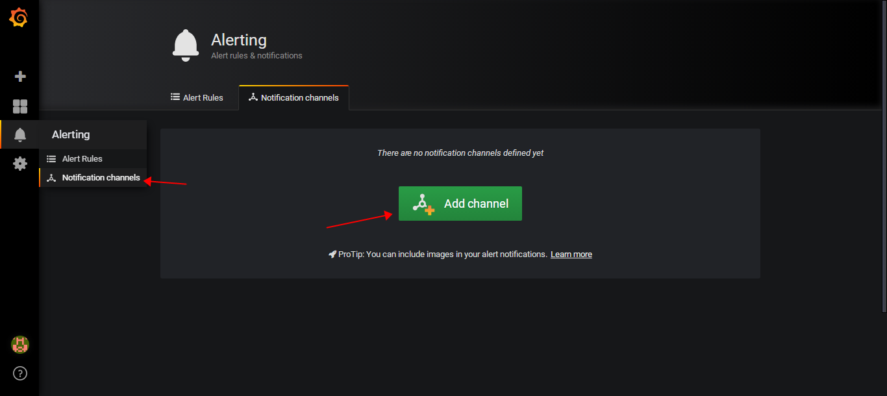
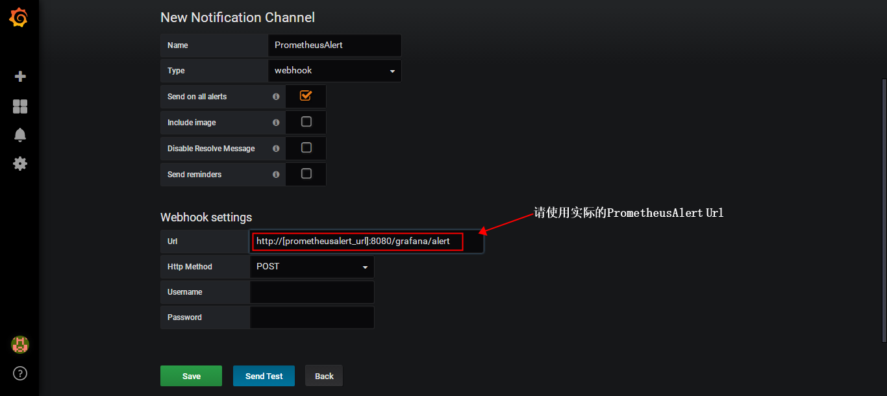
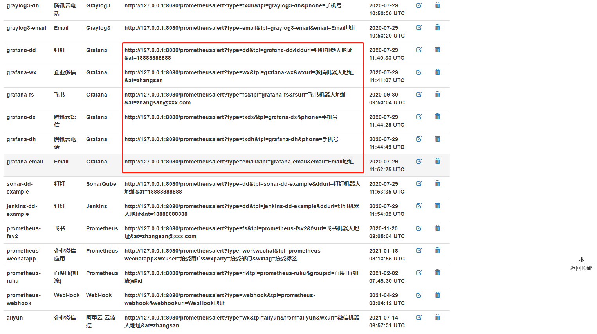
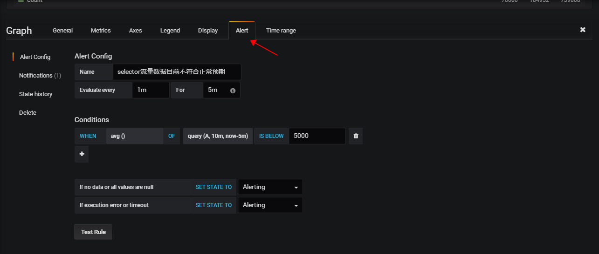
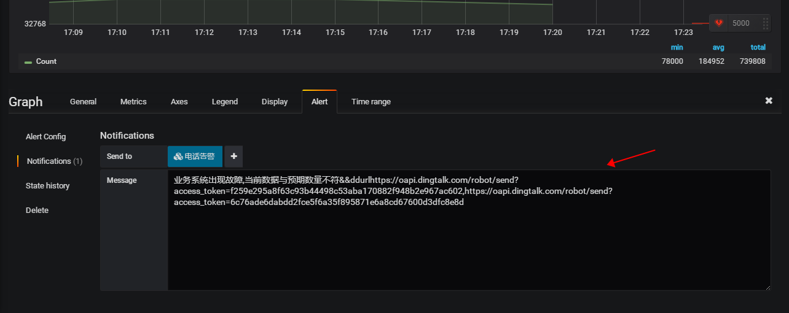

 **Grafana 接入配置**

首先使用管理员或者具有告警配置权限的帐号登录进Grafana管理页面，登录后进入notification channels配置。

##### 注意此处的地址需要去PrometheusAlert的模版页面获取，如发送给钉钉的grafana模版`http://[prometheusalert_url]:8080/prometheusalert?type=dd&tpl=grafana-dd&ddurl=钉钉机器人地址&at=18888888888`

PrometheusAlert的模版页面

配置完成后保存即可.继续进行告警消息配置,选择任意一个折线图,点击编辑,进入aler配置,配置参考下图:

最终告警效果:

