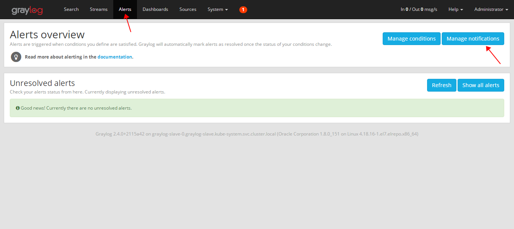
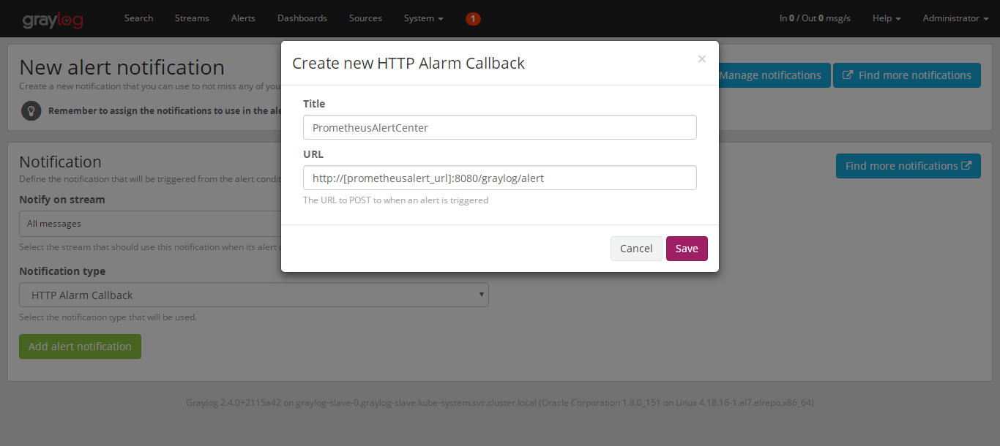
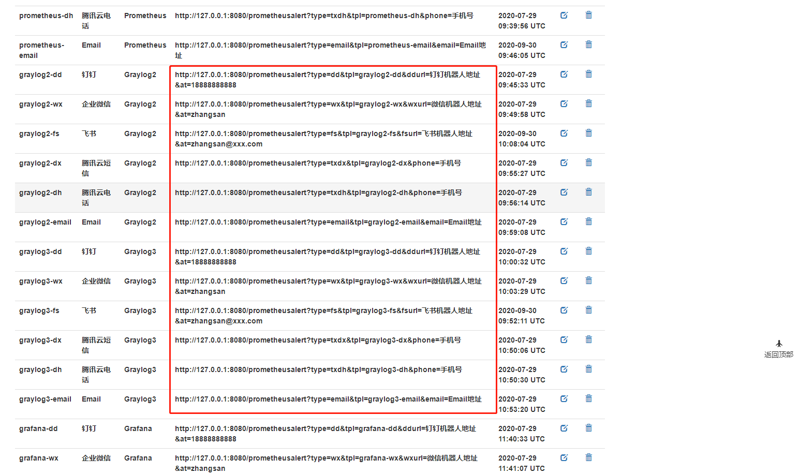
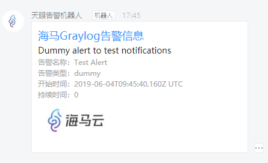

 ## graylog接入配置
 
首先使用管理员或者具有告警配置权限的帐号登录进Graylog日志系统后台，打开Graylog管理页面并进入Alerts配置。



点击```Add new notification```创建新的告警通道,选择如下图配置:


在弹出的窗口中填入名称和对应的PrometheusAlert的接口地址（接口地址可以去PrometheusAlert的自定义模板页面获取）即可(graylog各版本消息有区别，默认PrometheusAlert集成了graylog2和graylog3的消息模版，其他版本的模版需要自行定义):

PrometheusAlert的自定义模板页面


配置完成后,点击```Test```测试下是否能够正常接收告警消息即可

最终告警效果:


