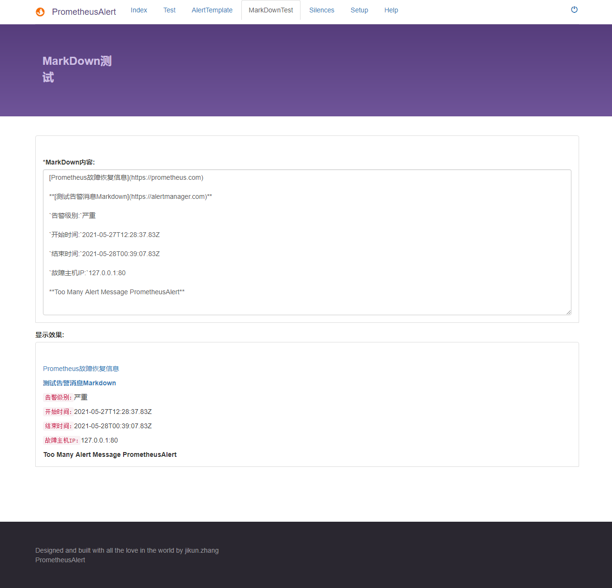

## markdown测试

PrometheusAlert Dashboard提供基础的Markdown文本编辑测试，方便部分模版(如钉钉、企业微信、飞书)格式调整。该页面仅供参考(由于钉钉、企业微信和飞书对Markdown的支持并不全面)


- 使用方法，在`MarkDown内容: `编辑框中输入Markdown文本，例如：

```
[Prometheus故障恢复信息](https://prometheus.com)

**[测试告警消息Markdown](https://alertmanager.com)**

`告警级别:`严重

`开始时间:`2021-05-27T12:28:37.83Z

`结束时间:`2021-05-28T00:39:07.83Z

`故障主机IP:`127.0.0.1:80

**Too Many Alert Message PrometheusAlert**
```

- `显示效果:`窗口即会实时显示渲染后的Markdown文本


