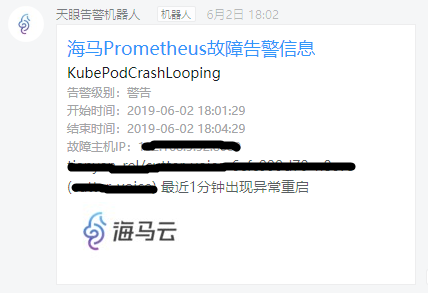

## Prometheus接入配置

Prometheus支持三种配置，`任选其一或者两者搭配均可`。

--------------------------------------

### 配置方法一（推荐）
通过自定义告警消息模版的方式(使用web页面上的自定义模版)
### 推荐此种配置方法，后续两种办法使用的都是程序内置的模版，不可改变

具体参考：[推荐 任意告警源（自定义消息模版）接入配置](customtpl.md)

最终告警效果:



--------------------------------------

### 配置方法二（内置模版）
通过Prometheus Rules方式(使用PrometheusAlert程序内置固定模版，非web页面上的模版)

首先需要在Alertmanager配置Webhook，可参考如下模板：

```
global:
  resolve_timeout: 5m
route:
  group_by: ['instance']
  group_wait: 10m
  group_interval: 10s
  repeat_interval: 10m
  receiver: 'web.hook.prometheusalert'
receivers:
- name: 'web.hook.prometheusalert'
  webhook_configs:
  - url: 'http://[prometheusalert_url]:8080/prometheus/alert'
```

Prometheus Server 的告警rules配置，可参考如下模板：

```
groups:
- name: node_alert
  rules:
  - alert: 主机CPU告警
    expr: node_load1 > 1
    labels:
      name: prometheusalertcenter
      level: 3   #告警级别,告警级别定义 0 信息,1 警告,2 一般严重,3 严重,4 灾难
    annotations:
      description: "{{ $labels.instance }} CPU load占用过高"  #告警信息
      mobile: 15888888881,15888888882,15888888883  #告警发送目标手机号(需要设置电话和短信告警级别)
      ddurl: "https://oapi.dingtalk.com/robot/send?access_token=xxxxxxxxxxxxxxxxxxxxxxxxxxxxxxxxxxxx,https://oapi.dingtalk.com/robot/send?access_token=xxxxxxxxxxxxxxxxxxxxxxxxxxxxxxxxxxxx" #支持添加多个钉钉机器人告警,用,号分割即可,如果留空或者未填写,则默认发送到配置文件中填写的钉钉器人地址
      fsurl: "https://open.feishu.cn/open-apis/bot/hook/xxxxxxxxx,https://open.feishu.cn/open-apis/bot/hook/xxxxxxxxx" #支持添加多个飞书机器人告警,用,号分割即可,如果留空或者未填写,则默认发送到配置文件中填写的飞书器人地址
      wxurl: "https://qyapi.weixin.qq.com/cgi-bin/webhook/send?key=xxxxxxxx-xxxxxx-xxxxxx-xxxxxx,https://qyapi.weixin.qq.com/cgi-bin/webhook/send?key=xxxxx-xxxx-xxxxxxx-xxxxx" #支持添加多个企业微信机器人告警,用,号分割即可,如果留空或者未填写,则默认发送到配置文件中填写的企业微信机器人地址
      email: "12345@qq.com,45678@baidu.com,91011@aliyun.com" #支持添加多个邮箱告警,用,号分割即可,如果留空或者未填写,则默认发送到配置文件中填写的邮箱地址
      groupid: "12345,678910" #支持添加多个如流群id,用,号分割即可,如果留空或者未填写,则默认发送到配置文件中填写的如流群id
      at: "1539510xxxx" #@某人功能，支持添加多个@目标，用,号分割即可。此处需注意：钉钉@使用的是手机号码，企业微信机器人@使用的是用户帐号，具体可参考各自说明文档
      #rr: "true" #开启随机轮询，目前仅针对ddurl，fsurl，wxurl有效，默认情况下如果上述Url配置的是多个地址，则多个地址全部发送，如开启该选项，则从多个地址中随机取一个地址发送，主要是为了避免消息发送频率过高导致触发部分机器人拦截消息
```

--------------------------------------

### 配置方法三（内置模版）
通过Prometheus AlertManager router方式(使用PrometheusAlert程序内置固定模版，非web页面上的模版)

针对 `/prometheus/router  AlertManager router指定接收端接口`,该接口可在url中直接指定告警的接收端,支持多个参数,分别是:wxurl,ddurl,fsurl,email,phone(phone用于短信和电话告警)

在 Prometheus Alertmanager 中配置Webhook，可参考如下模板：

```
global:
  resolve_timeout: 5m
route:
  group_by: ['instance']
  group_wait: 10m
  group_interval: 10s
  repeat_interval: 10m
  receiver: 'web.hook.prometheusalert'
  routes:
  - receiver: 'prometheusalert-weixin'
    group_wait: 10s
    match:
      level: '1'
  - receiver: 'prometheusalert-dingding'
    group_wait: 10s
    match:
      level: '2'
  - receiver: 'prometheusalert-feishu'
    group_wait: 10s
    match:
      level: '3'
  - receiver: 'prometheusalert-ruliu'
    group_wait: 10s
    match:
      level: '3'
  - receiver: 'prometheusalert-all'
    group_wait: 10s
    match:
      level: '4'
receivers:
- name: 'web.hook.prometheusalert'
  webhook_configs:
  - url: 'http://[prometheusalert_url]:8080/prometheus/alert'
- name: 'prometheusalert-weixin'
  webhook_configs:
  - url: 'http://[prometheusalert_url]:8080/prometheus/router?wxurl=https://qyapi.weixin.qq.com/cgi-bin/webhook/send?key=xxxxx'
- name: 'prometheusalert-dingding'
  webhook_configs:
  - url: 'http://[prometheusalert_url]:8080/prometheus/router?ddurl=https://oapi.dingtalk.com/robot/send?access_token=xxxxx'
- name: 'prometheusalert-feishu'
  webhook_configs:
  - url: 'http://[prometheusalert_url]:8080/prometheus/router?fsurl=https://open.feishu.cn/open-apis/bot/hook/xxxxxxxxx'
- name: 'prometheusalert-ruliu'
  webhook_configs:
  - url: 'http://[prometheusalert_url]:8080/prometheus/router?groupid=123456'
- name: 'prometheusalert-all'
  webhook_configs:
  - url: 'http://[prometheusalert_url]:8080/prometheus/router?wxurl=https://qyapi.weixin.qq.com/cgi-bin/webhook/send?key=xxxxx&ddurl=https://oapi.dingtalk.com/robot/send?access_token=xxxxx&email=123@qq.com&phone=15395105573'
```
