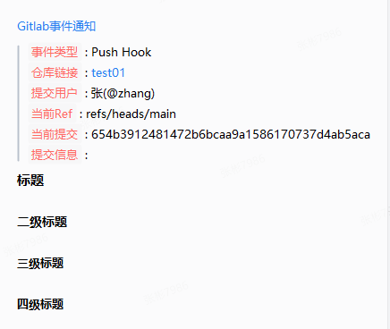
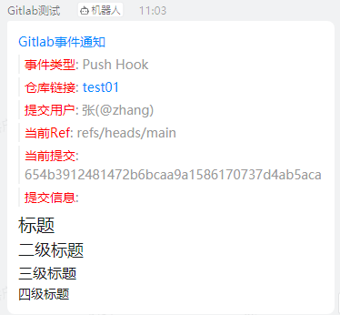
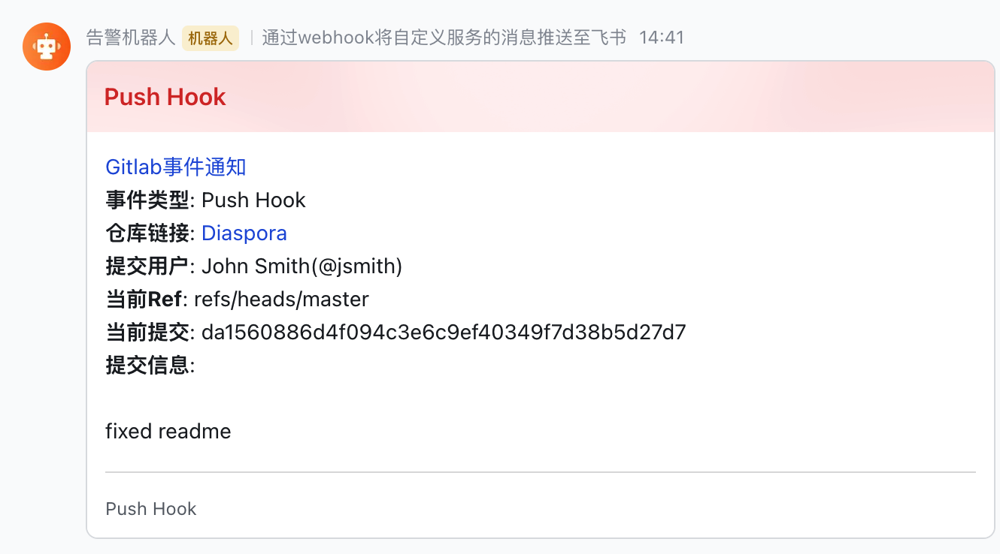

# Gitlab接入配置

----------------------------------------

将Gitlab webhook event通过PrometheusAlert通知到其它软件。

目前支持的gitlab event类型:

- Push
- Tag Push
- Issue
- Comment
- Merge Request
- Wiki Page
- Pipeline
- Job
- Deployment
- Feature Flag
- Release

目前支持通知到:

- 企业微信机器人(`/gitlab/weixin?wxurl=xxx`)
- 钉钉机器人(`/gitlab/dingding?ddurl=xxx`)
- 飞书机器人(`/gitlab/dingding?fsurl=xxx`)

地址不支持写多个，如需要多个，可创建多个gitlab webhoook。

## 配置步骤

进入gitlab仓库界面，在`设置->Webhooks`里，填写接口地址和机器人地址，选择触发来源事件，之后就可以测试了。

## 展示效果

### Push事件

微信机器人效果:

钉钉机器人效果:

飞书机器人效果:

