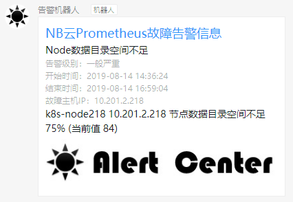

# Prometheus接入配置

--------------------------------------

## 配置方法

### 1.更改Alertmanager的配置，将所有告警信息都转发到PrometheusAlert,参考如下Alertmanager配置如下：

PS:示例内容是默认选择的钉钉机器人的自定义模板`prometheus-dd`，如使用其他接收端，请更改Url参数中的`type`和`tpl`即可，具体接口参数可参考  [接口说明](base-restful.md)

```
global:
  resolve_timeout: 5m
route:
  group_by: ['instance']
  group_wait: 10m
  group_interval: 10s
  repeat_interval: 10m
  receiver: 'web.hook.prometheusalert'
receivers:
- name: 'web.hook.prometheusalert'
  webhook_configs:
  - url: 'http://[prometheusalert_url]:8080/prometheusalert?type=dd&tpl=prometheus-dd&ddurl=https://oapi.dingtalk.com/robot/send?access_token=xxxxxxxxxxxxxxxxxxxxxx&at=18888888888'
```

配置完成后，重启或者reload Alertmanager，使配置生效即可。

最终告警效果:



更多自定义模版详细使用也可参考：[★ 进阶用法--自定义模版](system-customtpl.md)
