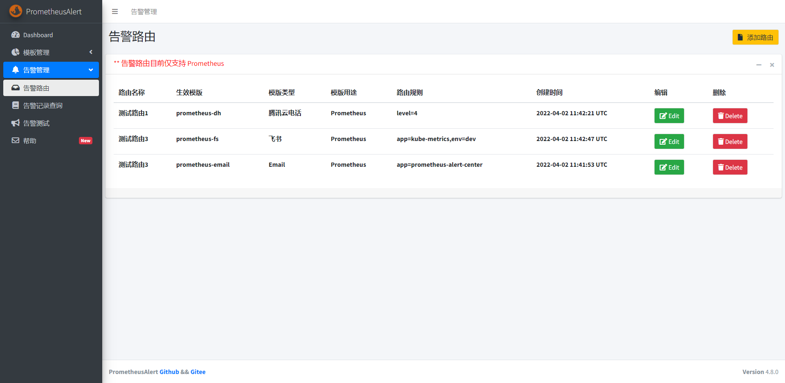
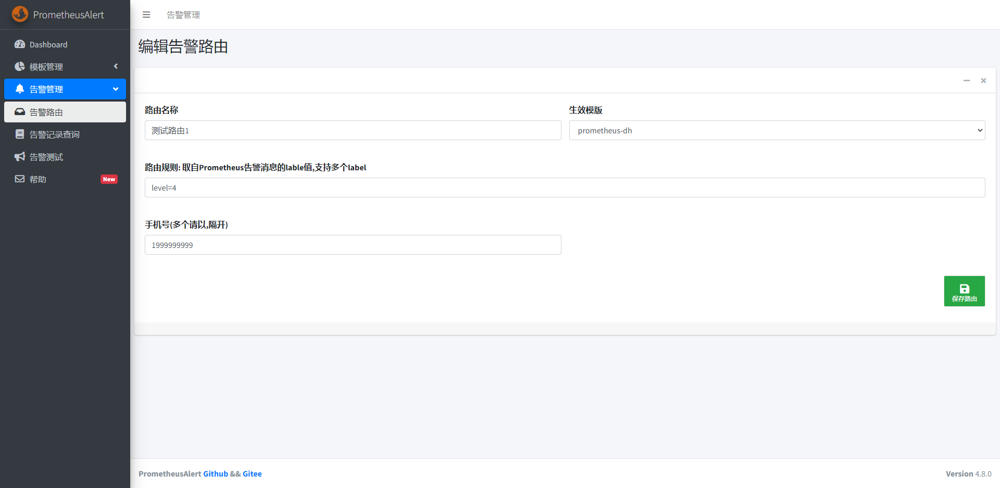
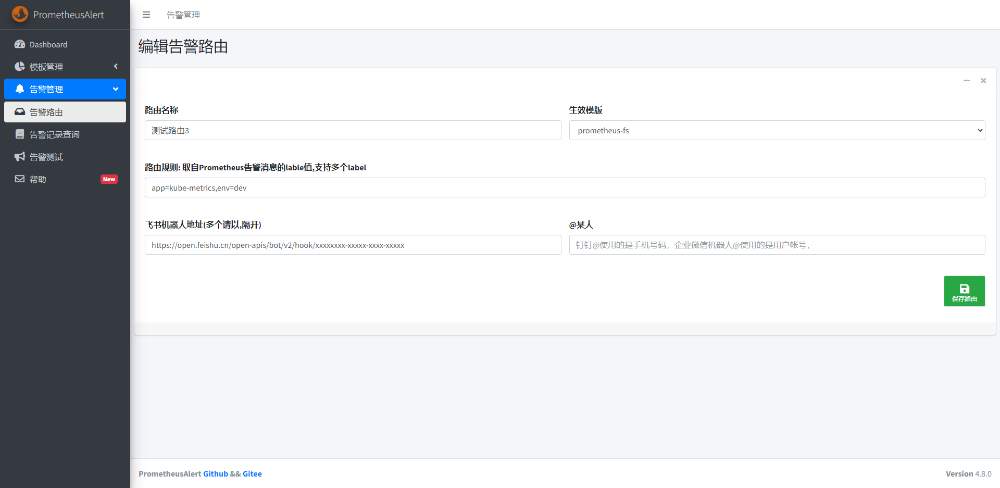
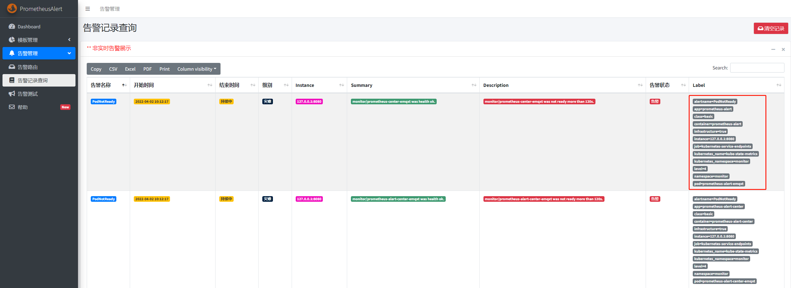

# 告警路由

--------------------------------------

## 简介

PrometheusAlert的告警路由目前仅支持Prometheus的告警消息。

告警路由的功能是通过过滤来自Prometheus告警消息中的label来实现将消息转发到不同的模板和模板对应的接收目标。整体设计类似Alertmanager的路由功能。



## 路由功能使用案例

假设默认的Prometheus Alertmanager配置如下：

```
global:
  resolve_timeout: 5m
route:
  group_by: ['instance']
  group_wait: 10m
  group_interval: 10s
  repeat_interval: 10m
  receiver: 'web.hook.prometheusalert'
receivers:
- name: 'web.hook.prometheusalert'
  webhook_configs:
  - url: 'http://127.0.0.1:8080/prometheusalert?type=dd&tpl=prometheus-dd&ddurl=https://oapi.dingtalk.com/robot/send?access_token=xxxxxxxxxxxxxxxxxxxxxx&at=18888888888'
```

在该配置下，所有Prometheus的告警消息均会通过PrometheusAlert的自定义模板 `prometheus-dd` 渲染消息后，转发到钉钉机器人 `https://oapi.dingtalk.com/robot/send?access_token=xxxxxxxxxxxxxxxxxxxxxx` ,并@手机号为 `18888888888` 的相关人员。

在许多场景下，可能存在需要将告警消息按照不同的分类发送给不同的接收目标和人员，比如：

- 将告警消息 label 中包含 `level=4` 的告警采用腾讯云电话的自定义模板，并转发给用户1999999999。则可以参考下图新增路由即可



- 将告警消息 label 中包含 `app=kube-metrics` 和 `env=dev` 的告警采用飞书的自定义模板，并转发给飞书机器人 `https://open.feishu.cn/open-apis/bot/v2/hook/xxxxxxxx-xxxxx-xxxx-xxxxx` 。则可以参考下图新增路由即可



## Prometheus 告警消息的 label 可以去PrometheusAlert页面的告警记录中查看，如图所示


