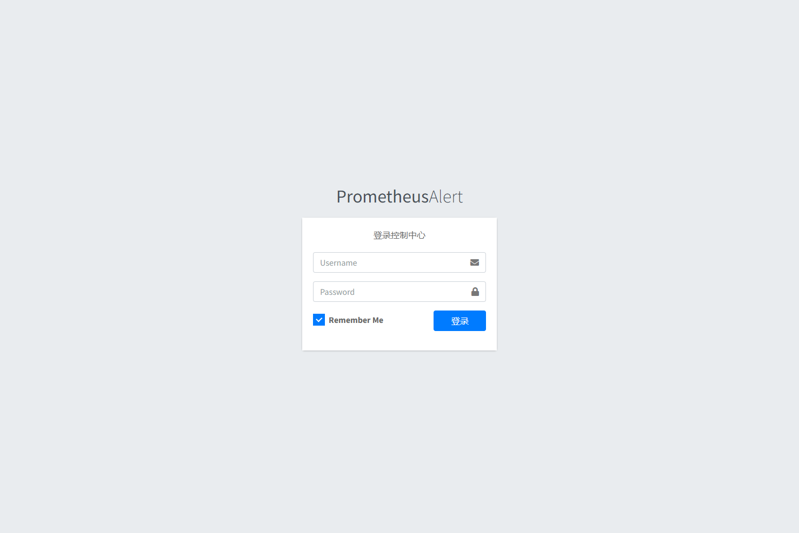
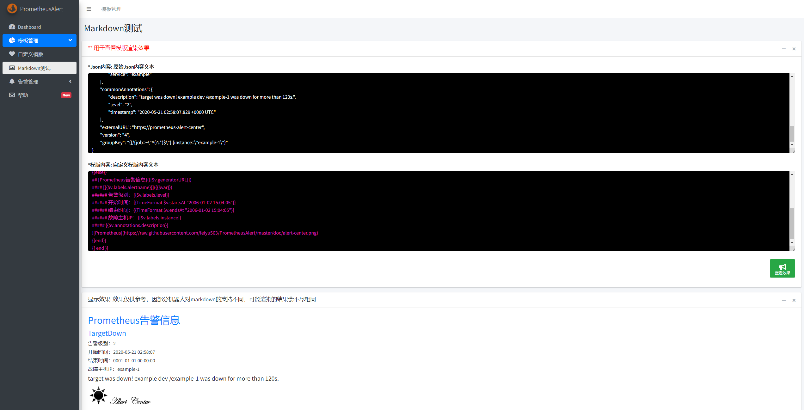
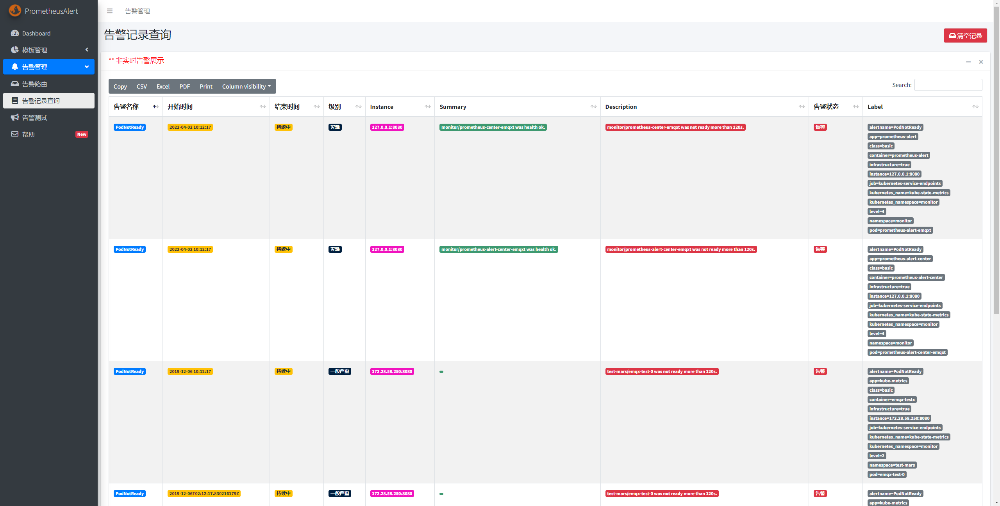
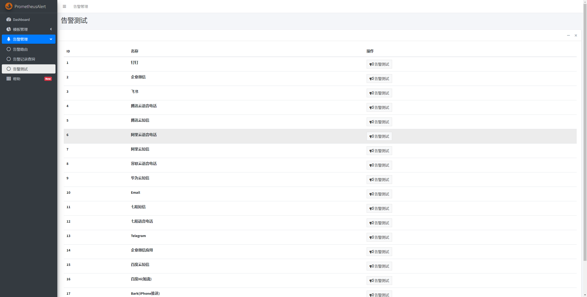

# Web页面功能使用

--------------------------------------

## 登录

--------------------------------------
默认的PrometheusAlert 登录帐号密码在配置文件app.conf中

```
#登录用户名
login_user=prometheusalert
#登录密码
login_password=prometheusalert
```



--------------------------------------

## Dashboard介绍

--------------------------------------

PrometheusAlert的Dashboard目前仅作为展示当前接收到的告警和已经发送的告警消息，重启后记录会自动清除。


--------------------------------------

## 模版管理-自定义模板

--------------------------------------

主要对自定义模板进行新增、编辑和测试，具体使用可参考 [★ 进阶用法--自定义模版](system-customtpl.md)


--------------------------------------

## 模版管理-MarkDown测试

--------------------------------------------------

PrometheusAlert Dashboard提供基础的Markdown文本编辑测试，方便部分模版(如钉钉、企业微信、飞书)格式调整。该页面仅供参考(由于钉钉、企业微信和飞书对Markdown的支持并不全面)

- `*Json内容`中填写从PrometheusAlert日志中提取的json,如：
```
{
	"receiver": "prometheus-alert-center",
	"status": "firing",
	"alerts": [{
		"status": "firing",
		"labels": {
			"alertname": "TargetDown",
			"index": "1",
			"instance": "example-1",
			"job": "example",
			"level": "2",
			"service": "example"
		},
		"annotations": {
			"description": "target was down! example dev /example-1 was down for more than 120s.",
			"level": "2",
			"timestamp": "2020-05-21 02:58:07.829 +0000 UTC"
		},
		"startsAt": "2020-05-21T02:58:07.830216179Z",
		"endsAt": "0001-01-01T00:00:00Z",
		"generatorURL": "https://prometheus-alert-center/graph?g0.expr=up%7Bjob%21%3D%22kubernetes-pods%22%2Cjob%21%3D%22kubernetes-service-endpoints%22%7D+%21%3D+1\u0026g0.tab=1",
		"fingerprint": "e2a5025853d4da64"
	}],
	"groupLabels": {
		"instance": "example-1"
	},
	"commonLabels": {
		"alertname": "TargetDown",
		"index": "1",
		"instance": "example-1",
		"job": "example",
		"level": "2",
		"service": "example"
	},
	"commonAnnotations": {
		"description": "target was down! example dev /example-1 was down for more than 120s.",
		"level": "2",
		"timestamp": "2020-05-21 02:58:07.829 +0000 UTC"
	},
	"externalURL": "https://prometheus-alert-center",
	"version": "4",
	"groupKey": "{}/{job=~\"^(?:.*)$\"}:{instance=\"example-1\"}"
}
```

- `*模版内容`中输入待测试的模版，例如：

```
{{ $var := .externalURL}}{{ range $k,$v:=.alerts }}
{{if eq $v.status "resolved"}}
## [Prometheus恢复信息]({{$v.generatorURL}})
#### [{{$v.labels.alertname}}]({{$var}})
###### 告警级别：{{$v.labels.level}}
###### 开始时间：{{TimeFormat $v.startsAt "2006-01-02 15:04:05"}}  
###### 结束时间：{{TimeFormat $v.endsAt "2006-01-02 15:04:05"}}  
###### 故障主机IP：{{$v.labels.instance}}
##### {{$v.annotations.description}}

{{else}}
## [Prometheus告警信息]({{$v.generatorURL}})
#### [{{$v.labels.alertname}}]({{$var}})
###### 告警级别：{{$v.labels.level}}
###### 开始时间：{{TimeFormat $v.startsAt "2006-01-02 15:04:05"}}  
###### 结束时间：{{TimeFormat $v.endsAt "2006-01-02 15:04:05"}} 
###### 故障主机IP：{{$v.labels.instance}}
##### {{$v.annotations.description}}

{{end}}
{{ end }}
```

- `显示效果:`窗口即会实时显示渲染后的Markdown文本



--------------------------------------

## 告警管理-告警记录查询

--------------------------------------

告警记录功能用于展示PrometheusAlert收到的Prometheus的告警消息，已经做了去重处理。非实时告警展示；目前仅支持记录Prometheus的告警消息。

告警记录功能默认为关闭状态，需要使用请在app.conf中进行开启，配置内容如下：

```
#是否开启告警记录 0为关闭,1为开启
AlertRecord=0
#是否开启告警记录定时删除 0为关闭,1为开启
RecordLive=0
#告警记录定时删除周期，单位天
RecordLiveDay=7
# 是否将告警记录写入es7，0为关闭，1为开启
alert_to_es=0
# es地址，是[]string
# beego.Appconfig.Strings读取配置为[]string，使用";"而不是","
to_es_url=http://localhost:9200
# to_es_url=http://es1:9200;http://es2:9200;http://es3:9200
# es用户和密码
# to_es_user=username
# to_es_pwd=password
```

告警记录支持多种方式存储，其中存储在Elasticsearch中的告警暂不支持在PrometheusAlert的页面上查看。参考：[告警记录-ES接入配置](conf-es.md)

为避免告警记录存储过多，建议开启告警记录定时删除功能。



--------------------------------------

## 告警管理-告警测试

--------------------------------------

警测试功能主要是通过发送测试消息校验配置文件的正确性

