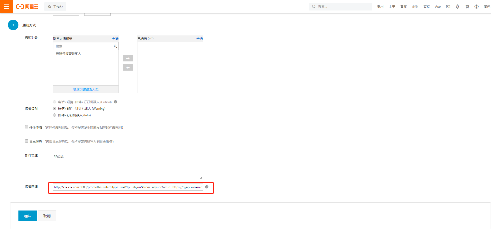

 **阿里云-云监控 接入配置**
 
首先到阿里云管理后台，继续如下：

1.登录[云监控控制台](https://cloudmonitor.console.aliyun.com/?spm=a2c4g.11186623.2.6.430f4226PAcUlA)

2.在左侧导航栏，选择报警服务 > 报警规则。

3.在阈值报警页签，单击目标规则对应操作列的修改。`说明 您也可以重新创建阈值的报警规则。具体操作，请参见创建阈值报警规则。`

4.在创建报警规则页面，输入报警回调的URL地址。`地址直接去PrometheusAlert AlertTemplate的页面新建或者使用默认的 阿里云-云监控 模版地址`，参考模版：
```
ALiYun {{.AlertState}}信息
>**{{.AlertName}}**
>告警级别: {{.TriggerLevel}}
开始时间: {{GetTime .Timestamp}}
故障主机: {{.InstanceName}}
------------详细信息--------------
metricName: {{.MetricName}}
expression: {{.Expression}}
signature: {{.Signature}}
metricProject: {{.MetricProject}}
userId: {{.UserId}}
namespace: {{.Namespace}}
preTriggerLevel: {{.PreTriggerLevel}}
ruleId: {{.RuleId}}
dimensions: {{.Dimensions}}
**当前值：{{.CurValue}}**
```

5.单击确认。如图



这样后面云监控触发告警后，PrometheusAlert就可以收到对应的告警信息，并实现告警。